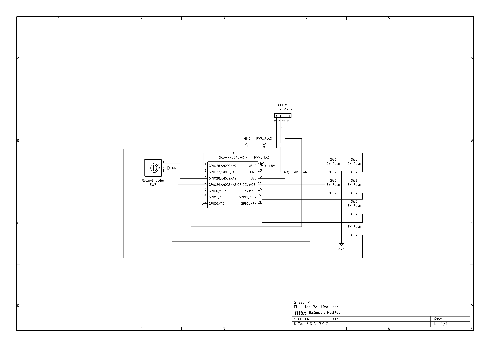
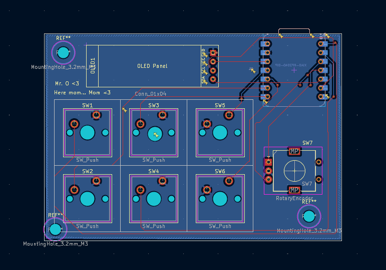
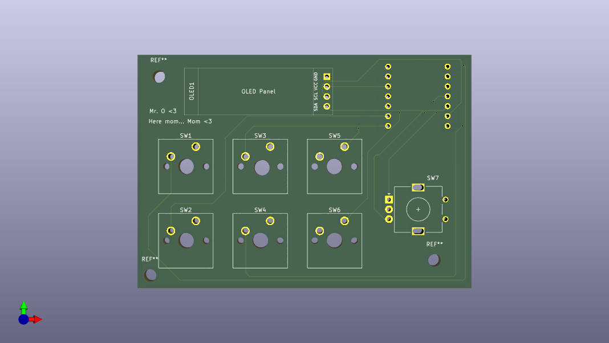
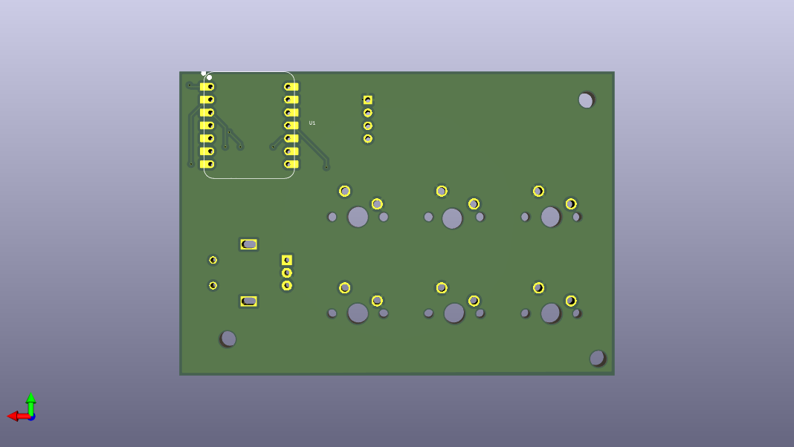
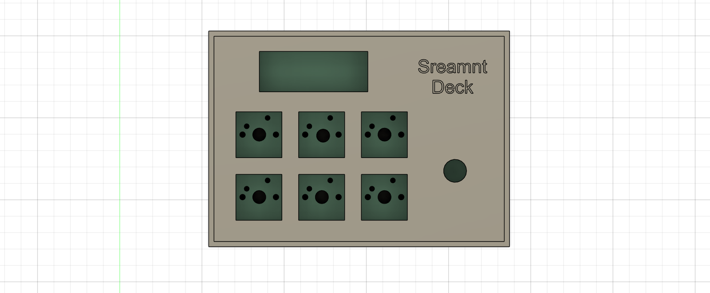
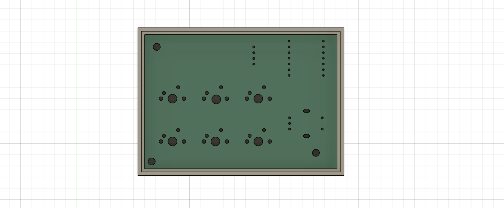
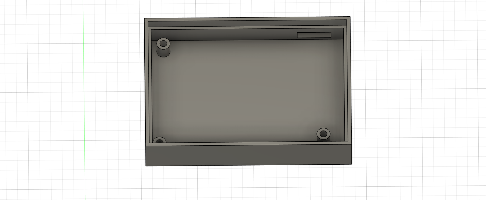
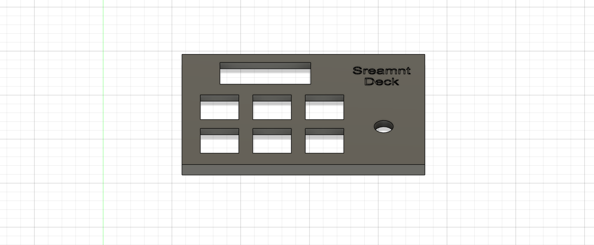

# Hackpad

A custom DIY macro pad inspired by (but not at all) Stream Deck.

This project is a small hardware controller built around the **Seeed XIAO RP2040**, featuring:
- 6× Cherry MX mechanical switches  
- 1× EC11 rotary encoder  
- 1× 0.91" SSD1306 OLED display (I2C)  
- A fully custom PCB (KiCad)  
- A 3D-printed snug-fit case

Designed and built as a Hack Club hardware project.

---

## Hardware Overview

- **MCU:** Seeed Studio XIAO RP2040 (DIP)
- **Switches:** Cherry MX compatible (6 total)
- **Encoder:** EC11 rotary encoder
- **Display:** SSD1306 OLED, 0.91", 128×32, I2C (4-pin)
- **Power:** USB-C via XIAO
- **Enclosure:** 3D printed (top + bottom)

---

## Pin Mapping

### Switches
| Switch | Function | XIAO Pin |
|------|--------|---------|
| SW1 | Key 1 | GPIO26 |
| SW2 | Key 2 | GPIO2 |
| SW3 | Key 3 | GPIO1 |
| SW4 | Key 4 | GPIO27 |
| SW5 | Key 5 | GPIO3 |
| SW6 | Key 6 | GPIO4 |

### Rotary Encoder
| Signal | XIAO Pin |
|------|---------|
| Encoder A | GPIO28 |
| Encoder B | GPIO29 |
| Encoder C | GND |

### OLED (SSD1306, I2C)
| Signal | XIAO Pin |
|------|---------|
| SDA | GPIO5 |
| SCL | GPIO6 |
| VCC | 3V3 |
| GND | GND |

---

### PCB
- KiCad project files (`.kicad_sch`, `.kicad_pcb`, `.kicad_pro`)
- Gerbers and drill files for manufacturing
- PDF exports of schematic and PCB
- STEP file for enclosure design

## PCB Images

### Case
- Fusion 360 design file
- STL files for:
  - `case_top.stl`
  - `case_bottom.stl`
-STEP files for:
  - `case_bottom.step`
  - `case_top.step`
  - `hackpad_case_assembly.step`

---

## Case Design Notes

- 3 mm walls and bottom thickness
- Internal snup-fit using wall thickness
- PCB is fully supported without mounting holes
- Designed for FDM printing (PLA+ / PETG recommended)

## Case Images

---

## Build Instructions (High Level)

1. Order PCB using the Gerbers in `hardware/kicad/fabrication/`
2. Solder:
   - Switches
   - Encoder
   - OLED header
3. Plug in XIAO RP2040
4. 3D print the case (STLs in `case/stl/`)
5. Assemble PCB into bottom case
6. Snap on top case
7. Flash firmware (see `firmware/`)

---

## Status

- Hardware: ✅ complete  
- PCB: ✅ routed and exported  
- Case: ✅ designed and printable  
- Firmware: Demo Ready

---

## License

MIT License — feel free to learn from, modify, and build on this project.

---

**STREAMN’T DECK**  
